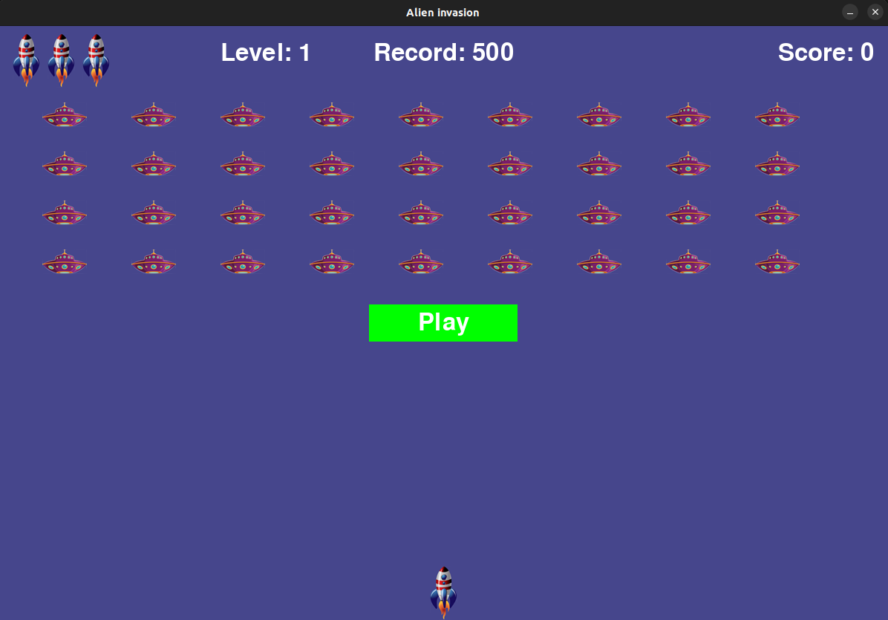

<div align=center margin= auto> 
  
</div>

# 👽 Alien Invasion
I created this game by following the "Python Crash Course" book by Eric Matthes. The reason was to improve my python skills.

## 🚀 Introduction
Every player controls the spacecraft, which is located in the middle of the low border of the screen. 
Player can move the spacecraft left and right with cursor control keys.
Spacebar is used to shoot aliens.

In the beginning of the game alien fleet is located at the top of the screen and gradually descends, shifting to the side.
Player shold destroy alien's spacecrafts with shots. If he manages to shoot down all the aliens, a new fleet appears that moves 
faster than the previous one. if the alien collides with the ship or goes to the bottom of the screen, the player loose his spacecraft.
If he looses all three spacecrafts the game is over.

## 🔧 Requeriments
- [Python](https://www.python.org/) 3.x +
- [Pygame](https://www.pygame.org/)

## :video_game: Controls

- Space-bar
  - Shoot

- Arrows keys (left - right)
  - Move the ship left / right

- Key Q
  - Quit the game
 
 ## ⚔ Let's play

### Cloning the Repository

```
$ git clone https://github.com/TeoMekh/Alien-invasion.git

$ cd Alien-Invasion
```

### Running 

```
$ python alien_invasion.py
``` 
